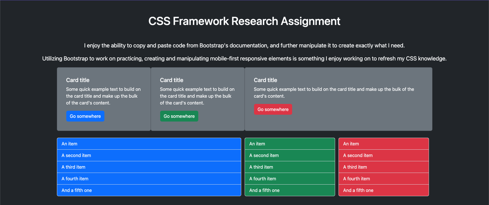

# CSS Framework Research Assignment

### Describe the Framework:
Bootstrap is a CSS Framework created to easily create mobile-first, modern and responsive websites. Designed for CSS Framework beginners, Bootstrap is a highly customizable Framework, which allows you to manipulate its pre-built documentation to create and customize any website or web application. Bootstrap also has built in JavaScript plugins, is compatible with SASS, and has helpful Utility APIs for customizing various pre-existing components. Although Bootstrap is widely used and very popular, I think it remains that way for a reason in the web development community because of its ease of use.

### Opinion about the Framework (why would I use it?):
I like to think of Bootstrap as a fresh new toolkit that can be used to build anything. I would use Bootstrap because of simple instruction, organised documentation, access to widely available online tutorials for its use, and customizable features via SASS and its JS plugins. In my previously created projects in IMD, I soley used Bootstrap as my basis for development and it has always worked perfectly and shines in its grid and flex capabilities. In the future, I would like to explore other Frameworks such as Foundation and Tailwind for building websites and applications.

Snapshot (Desktop Viewport):

### References:
- [Bootstrap 5.3](https://getbootstrap.com/)
- [Readme Documentation](https://docs.readme.com/rdmd/docs)